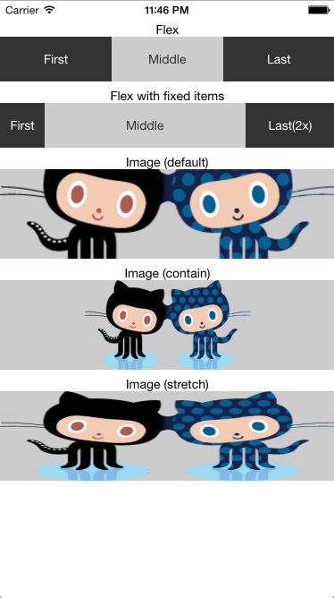

# react-native-layout-playground
React Native layout playground

## Preview

## Examples

### FlexView

~~~js
'use strict';

var React = require('react-native');

var {
  Text,
  View,
  StyleSheet,
} = React;

module.exports = React.createClass({
  render: function() {
    return (
      <View style={[css.row]}>
        <View style={[css.center, styles.items, styles.dark]}>
          <Text style={styles.white}>First</Text>
        </View>
        <View style={[css.center, styles.items, styles.light]}>
          <Text style={styles.black}>Middle</Text>
        </View>
        <View style={[css.center, styles.items, styles.dark]}>
          <Text style={styles.white}>Last</Text>
        </View>
      </View>
    );
  }
});

var css = require('../CommonStyles');
var styles = StyleSheet.create({
  items: {
    flex: 1,
    height: 50,
  },

  light: {
    backgroundColor: 'rgba(0,0,0,0.2)',
  },
  dark: {
    backgroundColor: 'rgba(0,0,0,0.8)',
  },
  white: {
    color: 'white',
  },
  black: {
    color: '#333333',
  },
});
~~~

### FlexViewFixed

~~~js
module.exports = React.createClass({
  render: function() {
    return (
      <View style={[css.row]}>
        <View style={[css.center, styles.itemsFixed, styles.dark]}>
          <Text style={styles.white}>First</Text>
        </View>
        <View style={[css.center, styles.items, styles.light]}>
          <Text style={styles.black}>Middle</Text>
        </View>
        <View style={[css.center, styles.itemsFixed, styles.dark, {width: 100}]}>
          <Text style={styles.white}>Last(2x)</Text>
        </View>
      </View>
    );
  }
});

var styles = StyleSheet.create({
  itemsFixed: {
    width: 50,
    height: 50,
  },
});
~~~

### FlexImage

~~~js
var css = require('../CommonStyles');

var getImageStyles = function(mode) {
  if (mode == 'contain') {
    return {flex: 1, resizeMode: Image.resizeMode.contain};
  } else if (mode == 'cover') {
    return {flex: 1, resizeMode: Image.resizeMode.cover};
  } else if (mode == 'stretch') {
    return {flex: 1, resizeMode: Image.resizeMode.stretch};
  } else {  // default
    return {flex: 1};
  }
};

module.exports = React.createClass({
  render: function() {
    return (
      <View style={[css.center, css.row, {backgroundColor: 'rgba(0,0,0,0.2)'}]}>
        <Image
            style={[{height: 100}, getImageStyles(this.props.mode)]}
            source={{uri: 'https://github.com/images/modules/dashboard/bootcamp/octocat_fork.png'}} />
      </View>
    );
  }
});
~~~
