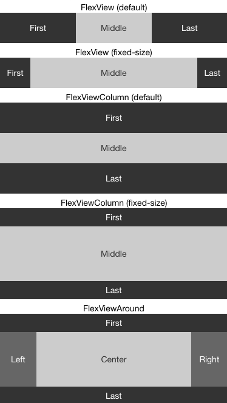
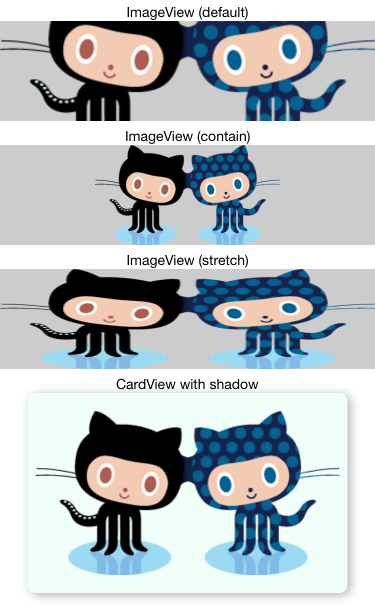
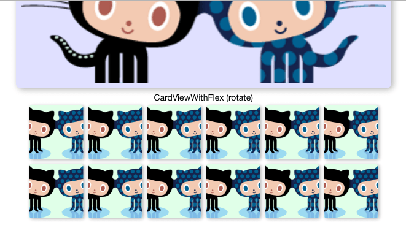
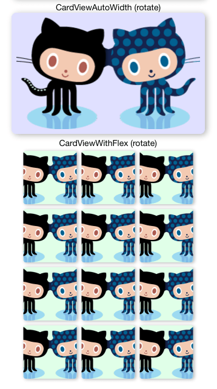

# react-native-layout-playground
React Native layout playground

## Preview

 

- Landscape

- Portrait

## Examples

### FlexView

- (default) 水平分割(等宽)
- (fixed-size) 左右固定宽度

### FlexViewColumn

- (default) 垂直分割(等高)
- (fixed-size) 上下固定高度

### FlexViewAround

- 环绕布局

### ImageView

- (default) 宽度自适应，限定高度(截断超出部分)
- (contain) 全部显示，限定高度
- (stretch) 缩放，限定高度

### CardView

- 固定长宽，图片平铺并显示阴影
